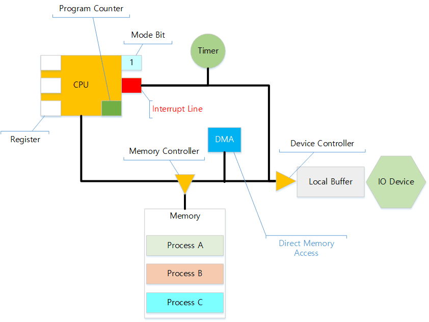

# OS-Concept

운영체제 스터디한 내용을 공유합니다.

내맘대로 재해석해서 옮깁니다. 오류가 있을 수 있습니다.

# 목차

## 입문

1. [About OS](#about-os)
2. [컴퓨터 시스템 구조](#computer-system)
   - CPU
   - Memory
   - IO Device
3. 프로세스 - 소개
   - About Process
   - Process Execution
   - Process Memory Structure
   - Process State
4. 커널 - 소개
   - Kernel Memory Structure
   - Process Control Block (PCB)
   - Context Switch
   - System Call
5. CPU 스케줄링
   1. 선점과 비선점 preemptive vs non-preemptive
   2. Scheduling Criteria
      - CPU Utilization
      - Throughput
      - Turnaround Time
      - Waiting Time
      - Response Time
   3. 스케줄링 종류
      - FCFS
      - SJF
      - Priority
      - Round Robin (RR)
      - Multilevel Queue
      - Multilevel Feedback Queue
6. 프로세스 - 동기화
   1. 다중작업
      - MultiProcess (IPC)
        - Message Passing
        - Shared Memory
   2. 문제
      - Race Condition
      - Cirtical Section
      - Kernel Race Condition

....

## About OS

### 운영체제

운영체제는 컴퓨터 하드웨어와 사용자를 연결해주는 소프트웨어다. 컴퓨터에 대한 모든 소프트웨어적 행동은 운영체제를 경유해 하드웨어를 사용하게 된다.

사용자와 사용자 프로세스는 운영체제가 있어야만 CPU, 메모리, 하드디스크 등 하드웨어(컴퓨터)에 접근할 수 있다. 때문에 켜져 있는 컴퓨터에서는 운영체제가 항상 메모리에 상주하고 있다. 부지런히 자원을 관리하고 사용자의 요청을 처리한다.

운영체제의 가장 큰 관심사는 자원의 효율적 관리다. 유한한 하드웨어와 유한한 성능을 가지고 최대한의 퍼포먼스를 내는 것이다. 더해서 컴퓨터 시스템을 보호하고 사용자와 운영체제 자신을 보호하는데도 목적이 있다.

잠깐, `자원`의 `효율적` `관리` 라고? 다른 분야에서도 관심있는 키워드다. 비즈니스에 OS를 대입해 보자.

집게사장을 상상해보자. 집게사장은 집게리아의 사장이다. 최저시급을 주고 깐깐징어를 고용했다. 깐깐징어는 집게리아에서 햄버거를 만드는 역할을 한다. 깐깐징어는 재료를 가져다 햄버거 만드는 일을 한다.

집게리아에는 여러 햄버거가 메뉴가 있다. 각 햄버거를 만들기 위해서는 빵과 게살, 특별 재료, 소스가 필요하다. 지하 창고에 재료들이 보관되어 있다. 깐깐징어에게는 시간당 월급을 주어야 한다. 욕심 많은 집게사장은 집게리아를 어떻게 운영해야 갑부가 될 수 있을까?

깐깐징어에게 쉼없이 일을 시킨다. 펑펑 놀면서 월급을 받는 꼴을 보면 집게사장은 속이 터질 것 같다. 뭐라도 시켜야 한다. 그렇다고 게살버거를 주문했는데 새우버거를 만들면 안된다. 깐깐징어는 상황에 따라 적절한 일을 해야 한다.

냉장고에는 적절한 재료를 준비해둔다. 멍청한 깐깐징어가 햄버거를 만들 때마다 지하 창고에 내려가면 햄버거 만드는 시간이 너무 오래 걸린다. 한번에 적절한 재료를 냉장고에 넣어 두어야 한다. 같은 햄버거 10개를 만들 때는 10개치 재료를 냉장고에서 꺼내와 가까이 두면 햄버거를 더 빨리 만들 수 있다.

깐깐징어가 불쌍하지만 집게사장은 운영(경영)을 잘해서 갑부가 되었다고 한다...

운영체제도 집게사장과 거의 비슷하다. 가장 비싼 자원인 CPU를 놀리지 않게 한다. 유한한 메모리를 적절히 관리하기 위해서 무엇을 메모리에 올려둘지 제어한다. 하드디스크에 무엇을 어디에 어떻게 저장할지 결정한다. 그리고 이것은 비단 컴퓨터 뿐 아니라 일상생활에서 어느 정도 활용할 수 있다. ~~불쌍한 깐깐징어~~

굳이 집게사장 비유를 든 것도 마찬가지다. 충분히 일상생활에서 있을만한 문제를, 전산학적으로 접근할 뿐이다. OS가 마주한 문제들에 공감하기 시작하면 의외로 쉽게 이해가 가능하다.

### 운영체제의 분류

여러 분류 기준에 따라 운영체제를 나눌 수 있다.

1. 동시작업 가능?
   - 단일 작업 - MS-DOS
   - 다중 작업 - 현대 OS
2. 단일 사용자?
   - 단일 사용자 - Window 
   - 다중 사용자 - UNIX, Linux
3. 처리 방식?
   - 모아서 한방에! Batch
   - 실시간으로 처리! RealTime
   - 시분할 Time Sharing. 현대 OS

### 주요 관심사

**좋은** 운영체제를 위한 문제들이다. 하드웨어 매니징이 가능하면 모두 OS라 부를 수 있겠지만, 다음 문제들을 잘 풀어내야 **좋은 운영체제**가 될 수 있다. 아래 문제를 설명하고 해법을 제시하는게 OS책의 대부분 내용이다.

- CPU 스케줄링
- 프로세스 관리
- 메모리 관리
- 파일 관리
- IO 관리
- 시스템 보호
- 네트워크

## Computer System

### CPU

- Instruction
- Register
- Program Counter
- Mode Bit
- Interrupt Line

